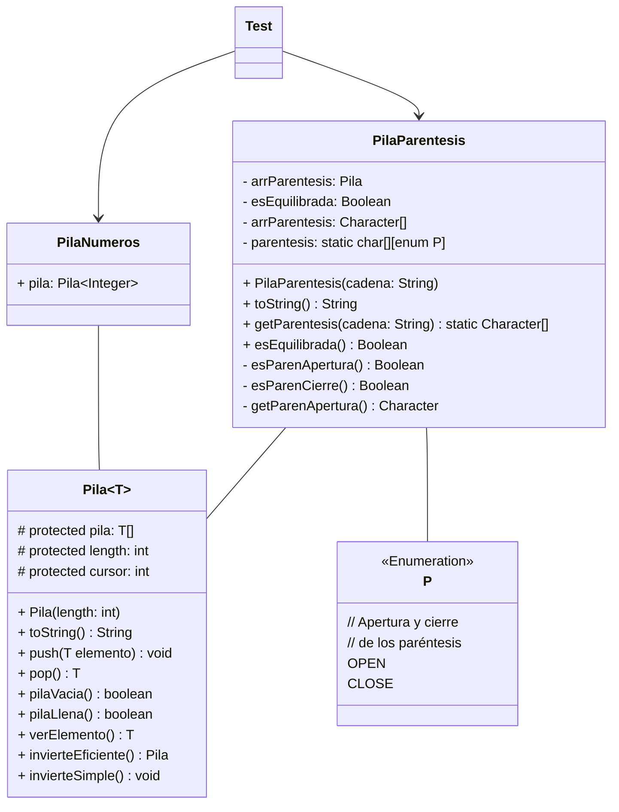

```mermaid
classDiagram
    class Pila~T~ {
        # protected pila: T[]
        # protected length: int
        # protected cursor: int

        + Pila(length: int)
        + toString() String

        + push(T elemento) void
        + pop() T
        + pilaVacia() boolean
        + pilaLlena() boolean
        + verElemento() T
        + invierteEficiente() Pila
        + invierteSimple() void

    }
    class PilaParentesis {
        - arrParentesis: Pila
        - esEquilibrada: Boolean
        - arrParentesis: Character[]
        - parentesis: static char[][enum P]

        + PilaParentesis(cadena: String)
        + toString() String
        + getParentesis(cadena: String) static Character[]
        + esEquilibrada() Boolean
        - esParenApertura() Boolean
        - esParenCierre() Boolean
        - getParenApertura() Character
    }
     class P {
        <<Enumeration>>
        // Apertura y cierre
        // de los paréntesis
        OPEN
        CLOSE
    }

    class PilaNumeros {
        + pila: Pila~Integer~

    }
    class Test {

    }

    PilaParentesis -- Pila
    PilaParentesis -- P
    PilaNumeros -- Pila
    Test --> PilaParentesis
    Test --> PilaNumeros

```
